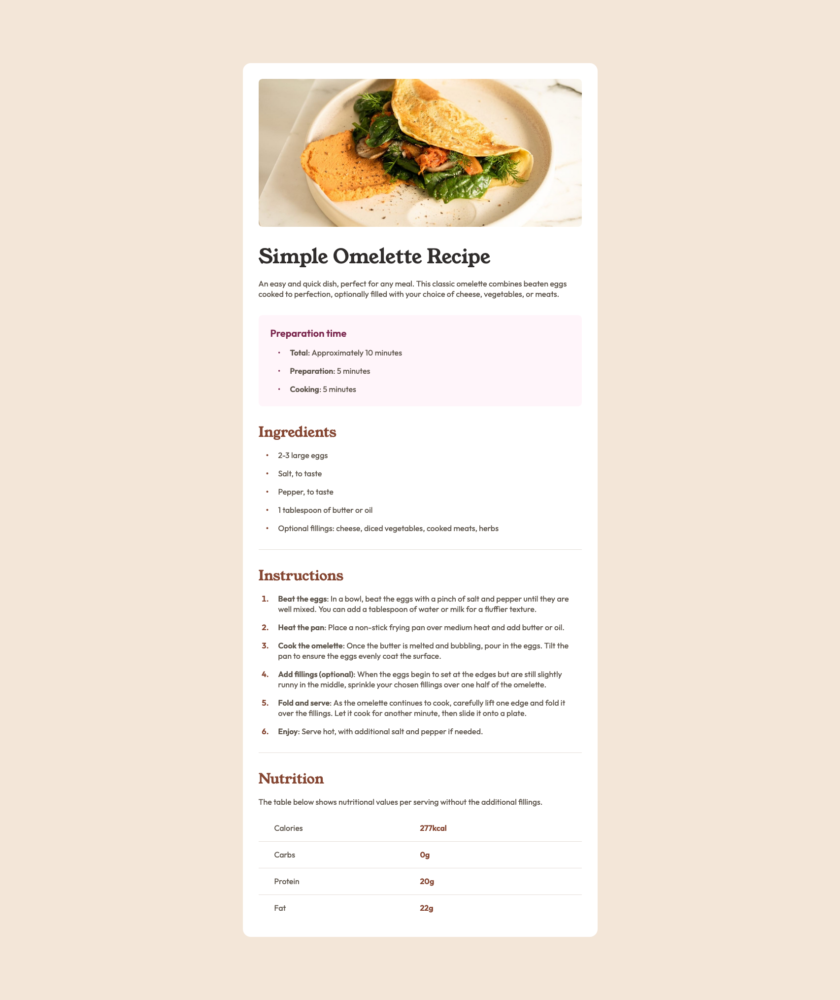

# Frontend Mentor - Recipe page


## Frontend Mentor - Recipe page solution

This is a solution to the [Recipe page challenge on Frontend Mentor](https://www.frontendmentor.io/challenges/recipe-page-KiTsR8QQKm). Frontend Mentor challenges help you improve your coding skills by building realistic projects.

## Table of contents

- [Overview](#overview)
  - [The challenge](#the-challenge)
  - [Screenshot](#screenshot)
  - [Links](#links)
- [My process](#my-process)
  - [Built with](#built-with)
  - [What I learned](#what-i-learned)
  - [Continued development](#continued-development)
  - [Useful resources](#useful-resources)
- [Author](#author)
- [Acknowledgments](#acknowledgments)

### The challenge

Your challenge is to build out this recipe page and get it looking as close to the design as possible.

### Screenshot



### Links

- Live Site URL: [Recipe page](https://ryanzeroseven.github.io/fem-recipe-page/)

## My process

### Built with

- Semantic HTML5 markup
- CSS custom properties
- CSS color-scheme
- CSS nesting
- CSS FlexBox
- CSS Grid

### What I learned

After doing a course on Udemy for beginners and advanced HTML/CSS, I only did one project which was my own resume. This was a year and a half ago.

I had to research again how to build up a HTML with the correct semantics which was very informative, I didn't think such a relatively simple design would make me doubt certain things.
It was my first time working from a design and it was a lot of fun. Took me nearly 5 hours to draw the HTML, set it up and build the design.
Since it is a relatively straight forward design I tried not to use classes but more so the HTML tags it self.

New things I worked with:

- :root variables,
- usage of table element,
- semantic HTML,
- and container queries.

```css
.proud-of-this-css {
  @container (max-width: 767px ) {
    * {
      --fs-400: 2.25rem;
    }

    h1 {
      text-wrap: pretty;
    }

    main {
      max-width: 100%;
      margin: 0;
      border-radius: 0;
    }

    .header {
      padding-top: 0;
      figure {
        overflow: unset;
        margin-left: calc(var(--spacing-medium) * -1);
        margin-right: calc(var(--spacing-medium) * -1);
      }
    }
  }
}
```

### Continued development

- For future projects I want to focus on writing more and better semantic HTML and CSS. I want to use 'aria-labels' more in places to make it a habit and understand what they are doing.
- Reusability, working with utility classes instead of a specific property declaration on a single element or class.
- Another concept would be container queries and different size units like: ch, cqi, svw and svh.
- As for responsive layouts, Grid is still a magic black box, so spending more time in that seems like a good next step.

### Useful resources

- [CSS Reset](https://codepen.io/kevinpowell/pen/abMdOpp) - This helped me reset my CSS.
- [Container query](https://www.youtube.com/watch?v=2rlWBZ17Wes&ab_channel=KevinPowell) - This helped me understand container queries.
- [Semantic sections](https://www.w3.org/WAI/ARIA/apg/patterns/landmarks/examples/region.html) - Information about how to write semantic sections.

## Author

- GitHub - [ryanzeroseven](https://github.com/ryanzeroseven)
- Frontend Mentor - [@ryanzeroseven](https://www.frontendmentor.io/profile/ryanzeroseven)

## Acknowledgments

I learned my HTML/CSS from [Jonas Schmedtmann](https://codingheroes.io/) in his Udemy courses. And I watch a lot of [Kevin Powell](https://www.kevinpowell.co/) youtube videos.
